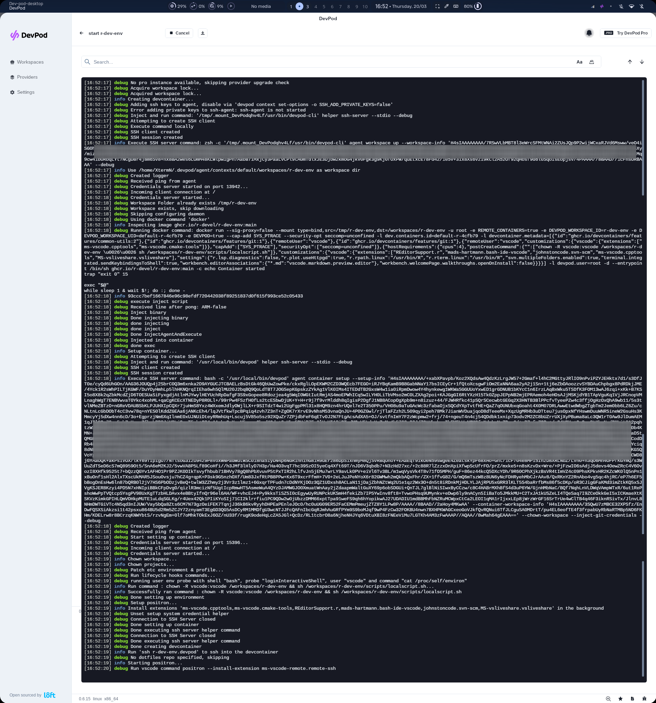
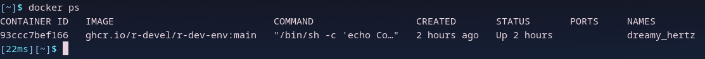
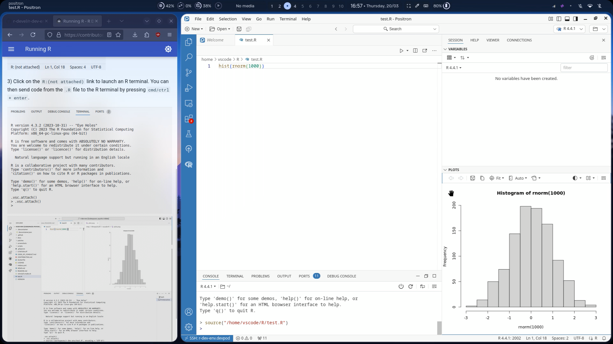
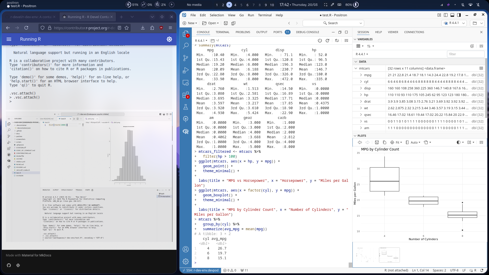
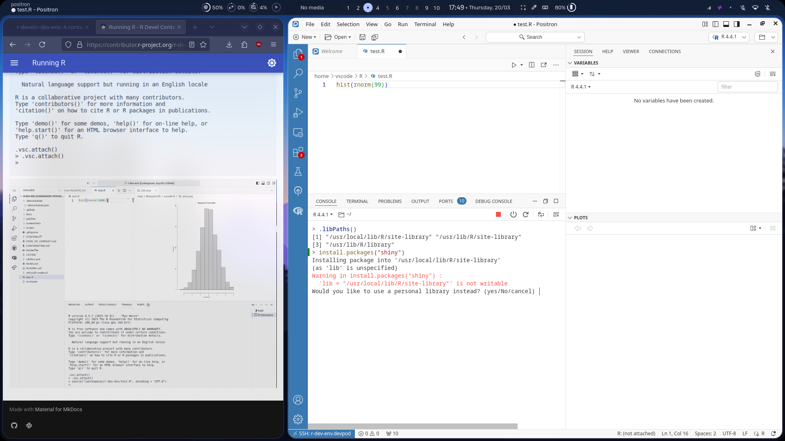

# Hard-2 Test Results

## Screenshot of the information messages shown when creating the workspace

(with debug mode enabled)

The docker container:

---

## Screenshot after following the [Running R](https://contributor.r-project.org/r-dev-env/tutorials/running_r/) tutorial

#### Screen Recording

<video src="./screenshots/running_r.mp4" controls width=500></video>

---

## What works and what doesn't?

I was able to follow the [Running R](https://contributor.r-project.org/r-dev-env/tutorials/running_r/) tutorial without any hurdle.

I tried exploring an in-built dataset and made a few plots, and encountered no issues at all.

The only issue I encountered is that the default library path (inside `usr`) is not writable by the ssh'ed-into user `vscode`, so a warning is shown for using a different library path while installing a package for the first time.

