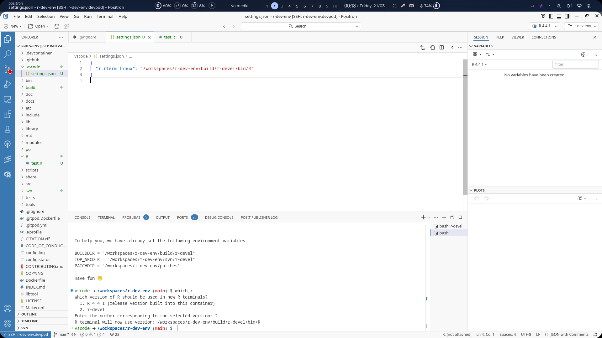

# Hard-2 Test Results

## Screenshot of the information messages shown when creating the workspace

(with debug mode enabled)

The docker container:

---

## Screenshot after following the [Running R](https://contributor.r-project.org/r-dev-env/tutorials/running_r/) tutorial

#### Screen Recording

<video src="./screenshots/running_r.mp4" controls width=500></video>

---

## What works and what doesn't?

I was able to follow the [Running R](https://contributor.r-project.org/r-dev-env/tutorials/running_r/) tutorial without any hurdle.

I tried exploring an in-built dataset and made a few plots, and encountered no issues at all.

The only issue I encountered is that the default library path (inside `usr`) is not writable by the ssh'ed-into user `vscode`, so a warning is shown for using a different library path while installing a package for the first time.

#### Update (this subheading was added after posting the link to this test result on the wiki page)

Playing around a little bit more, I found that some of the functionality (specifically, the `which_r` bash function included with the container) that is vscode-specific, also doesn't work in positron.

Update#2:I could get `which_r` to work, albeit partially. This was by creating an empty (i.e. `{}`) `/workspaces/r-dev-env/.vscode/settings.json`, so the `which_r` script no longer fails to find the settings file. 
- This works because positron (atleast when launched through devpod) uses the same R extension as vscode (for which `which_r` is designed) does.
- This also does NOT work because positron ALSO uses its own console (e.g. for running, it doesn't use the R session "attached" by the aforementioned vscode R extension, but its own console).

Hence, I still need to figure out how to make the positron console use the built version.
