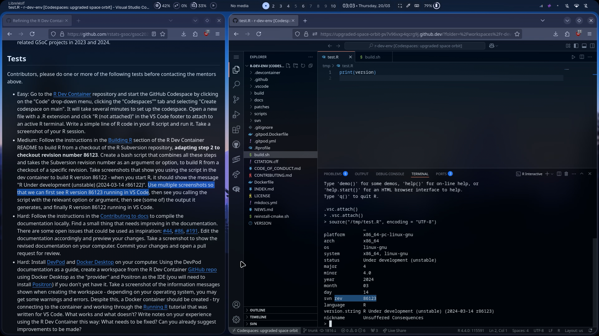
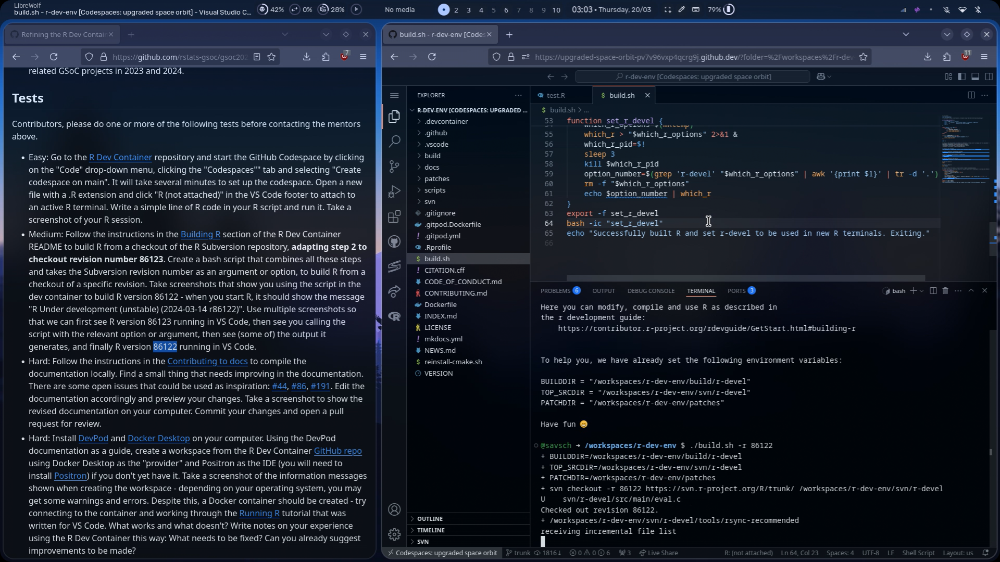
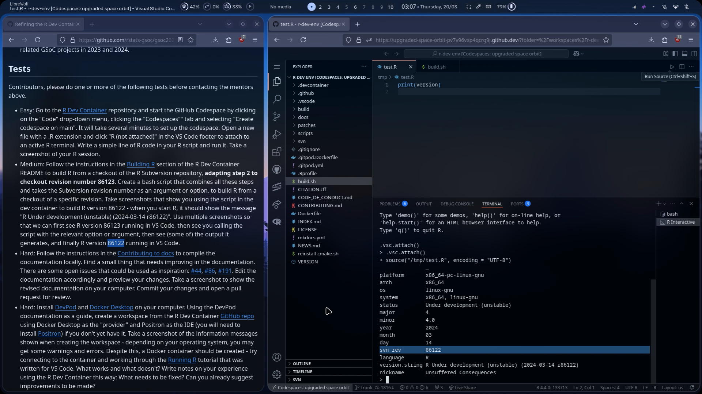

# Medium Test Results

### The Bash Script

```bash
#!/bin/bash
set -euo pipefail
# Reference: https://contributor.r-project.org/r-dev-env/tutorials/building_r/

print_usage_and_exit() {
    echo "Usage: $0 -r revision"
    echo "  -r revision   SVN revision number to checkout (required)"
    echo "  -h            Display this help message"
    exit 1
}

while getopts "r:h" opt; do
    case "$opt" in
        r)  REVISION="$OPTARG" ;;
        h)  print_usage_and_exit ;;
        ?)  print_usage_and_exit ;;
    esac
done

if [ -z "${REVISION:-}" ]; then
    echo "Missing required keyword argument (-r)."
    print_usage_and_exit
fi

set -x

# Step 1: Set environment variables to defaults if they aren't already set for whichever reason
BUILDDIR="${BUILDDIR:-/home/vscode/build/r-devel}"
TOP_SRCDIR="${TOP_SRCDIR:-/home/vscode/svn/r-devel}"
PATCHDIR="${PATCHDIR:-/home/vscode/patches}"

# Step 2: svn checkout
svn checkout -r "$REVISION" https://svn.r-project.org/R/trunk/ $TOP_SRCDIR

# Step 3: Download recommended packages
$TOP_SRCDIR/tools/rsync-recommended

# Step 4: Switch the directory to $BUILDDIR
mkdir -p $BUILDDIR
cd $BUILDDIR

# Step 5: Configure the build
$TOP_SRCDIR/configure --with-valgrind-instrumentation=1

# Step 6: Build R
make

# Step 7: Check R
make check

# Step 8: Make the which_r script select r-devel (automatically)
# Since the which_r function exists in .bashrc which isn't available to scripts by default, I resort to the below workaround:
function set_r_devel {
    which_r_options=$(mktemp)
    which_r > "$which_r_options" 2>&1 &
    which_r_pid=$!
    sleep 3
    kill $which_r_pid
    option_number=$(grep 'r-devel' "$which_r_options" | awk '{print $1}' | tr -d '.')
    rm -f "$which_r_options"
    echo $option_number | which_r
}
export -f set_r_devel
bash -ic "set_r_devel"
echo "Successfully built R and set r-devel to be used in new R terminals. Exiting."

```

### Screenshots

#### 1. R version 86123 running in VS Code




#### 2. Some of the script output




#### 3. R version 86122 running in VS Code




### Recording of the Entire Test

(fast forwarded the building part)

<video src="./screenshots/0.mp4" controls width=500></video>

